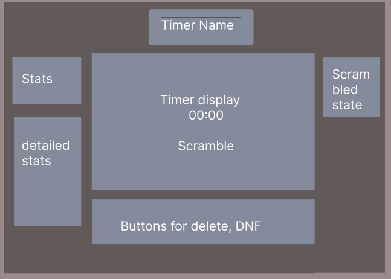

## General Layout Plan

Here is a rough layout for what the timer might look like:

## UI Decisions

So at the start I originally wanted to use a grey-overall theme, that includes the buttons, windows, text etc...
After mulling over the details, I did not want to follow the psuedo-professional, monotone theme that most websites now adopt
I figured might as well put some personality (for all that its worth) into the subtle details of the website
    - some rubiks colored theme on texts, buttons, borders, etc... (CONCERN: may look too sloopy or "childish" if not managed with care and planning)

